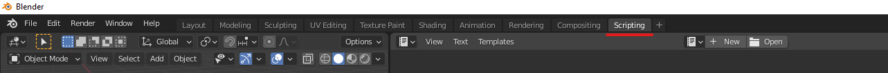
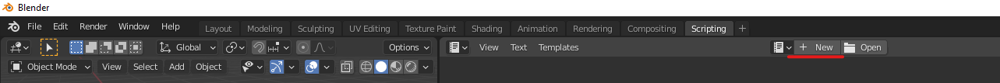
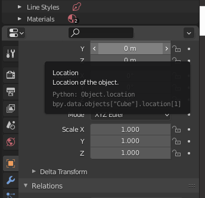

# Intro to Python in Blender

## Where to use python in Blender
The easiest way to start using python in Blender is to select the "Scripting" workspace from the menu bar.



This provides several panels that are useful. The bottom left has the Python Console, and the right has a Text Editor.

The python console works just like any other, but also includes autocompletion, making it a very convenient place to check what blender python functions are available.

The text editor can open existing scripts, or create new ones. It is most useful for writing and testing quick snippets, but you'll most likely want to write your whole script in an IDE like PyCharm. You can create a new text file in Blender's text editor by clicking the New button at the top:



After writing some code, click the triangular Play icon to run the script. Any printed output will appear in the system console (not the python console!) which can be found by selecting `Window > Toggle System Console`. 

## Where to write scripts for Blender
There is a user location that blender looks in for python files. When writing your own scripts, they should be saved in the right folder for your operating system (OS). Note that you may need to create this folder as it might not exist already (make sure you've spelled it correctly!). If you had to create the folder, you'll have to restart Blender to pick up the files. Once it already exists, you can just add files to the folder and immediately import them. The directory for each OS is:
* Windows: `%USERPROFILE%\AppData\Roaming\Blender Foundation\Blender\3.0\scripts\addons`
  - Example: `C:\Users\mshaw\AppData\Roaming\Blender Foundation\Blender\3.0\scripts\addons`
* Linux: `$HOME/.config/blender/3.0/scripts/addons`
  - Example: `/home/mshaw/.config/blender/3.0/scripts/addons`
* Mac: `/Users/$USER/Library/Application Support/Blender/3.0/scripts/addons`
  - Example: `/Users/mshaw/Library/Application Support/Blender/3.0/scripts/addons`

There is also a directory you can place files in that will automatically import when blender starts. This can be useful if you have specific setup needs, but shouldn't be used unless you specifically need startup behaviour. The folder is the same as above, but replace `addons` with `startup`.

For full details, see the blender [directory information](https://docs.blender.org/manual/en/dev/advanced/blender_directory_layout.html#blender-directory-layout).

## Python in Blender
If you're planning on developing in Blender, you should enable a couple of useful options. Go to `Edit > Preferences > Interface` and check `Python Tooltips` and `Developer Extras`.

`Python Tooltips` provides the python command to access the value of a property when hovering over it in the UI. For example, selecting an object and mousing over the "Location" property in the properties editor shows the following: 



Which we can then use in the python shell to access the same value
```python
>>> bpy.data.objects["Cube"].location[1]
0.0
```

`Developer Extras` enables several features, the most useful being an extra option in the right click menu to go to the Online Python Reference for that property.

See Blender's [Quickstart Docs](https://docs.blender.org/api/current/info_quickstart.html) and the other pages in the sidebar for full details on getting started. Below is a quick summary of the basics.

## API
Blender's python package is called `bpy`, but it also provides a `mathutils` package for performing a lot of common math operations like vectors and matrices. There is autocompletion in the python shell, so you can simply import the module, add a `.` and press Tab to see all the options inside. This works whatever object you're looking at.

```python
import bpy
import mathutils
```

### Data
`bpy.data` refers to data within the scene such as meshes, objects, materials, etc... Each group of objects referenced here works much like a python dictionary, you can access individual elements using the getitem syntax with a name or with an index. Indexes might change though as you modify the scene, so it's better to rely on names. It's also possible to use a `.get()` method.
```python
scene = bpy.data.scenes["Scene"]
other_scene = bpy.data.scenes.get("NotARealScene")  # None
```
Data is also used for creating and destroying elements
```python
mesh = bpy.data.meshes.new("MyNewMesh")
bpy.data.meshes.remove(mesh)
```

It's possible to drill down into details of objects by using properties, eg
```python
# Get the X-axis value for the first vertex on the Cube object
x_value = bpy.data.objects["Cube"].data.vertices[0].co.x
# Set the X-axis value for the first vertex on the Cube object
bpy.data.objects["Cube"].data.vertices[0].co.x = 2.0
```

### Context
Refers to active/selected state, eg, selected mesh/object/collection/etc... This is commonly used for custom scripts, as generally a user running commands expects them to work on the selected object(s).
```python
bpy.context.selected_objects  # All selected objects
bpy.context.active_object  # The last selected object
```

### Operators
These are existing functions for common behaviours, like `bpy.ops.mesh.flip_normals()`. However, most of these are context-aware, meaning they will only work if the user's cursor is in the right context. Trying to run the flip_normals op from the shell will fail because you're in the shell and not in the viewport. Ops are intended to be used from scripts rather than run directly.

Mousing over buttons in Blender with `Python Tooltips` enabled should show you what operator (if any) they use.

### Auto-completion in PyCharm
If you want to have auto-completion in PyCharm, follow the instructions [here](https://b3d.interplanety.org/en/using-external-ide-pycharm-for-writing-blender-scripts/). The short version is:
1. Install the same python version that your Blender uses.
2. Create a new pycharm project that uses that python version's interpreter.
3. Create/Download the auto-complete files for your blender version - these are basically python files with only function definitions, no code.
4. Link the auto-complete files with the PyCharm project.
