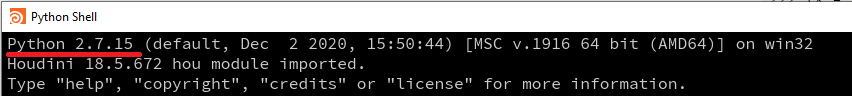

# Intro to Houdini API

## Where to use python in Houdini - Python Shell
Houdini has a builtin python shell which can be opened from the menus at the top using `Windows > Python Shell`. It looks just like the standard python shell, but has access to the houdini modules. It also provides autocomplete options - use the up/down arrows keys to select one when the dropdown appears after typing.

## Where to write scripts for Houdini
Houdini will automatically make any scripts in pythonX.Xlibs folders from your houdini user folder available, where X.X is your python version (eg, 2.7). To find out where your houdini user folder is, run the following command from the houdini python shell `hou.homeHoudiniDirectory()`.

For example on windows using houdini 18.5 and python 2.7 I can do the following:
* Run `hou.homeHoudiniDirectory()` which gives `C:/Users/Matthew/Documents/houdini18.5`
* Create a folder in there called `python2.7libs`, eg, `C:/Users/Matthew/Documents/houdini18.5/python2.7libs`
* Add any custom scripts inside that folder and restart houdini
* The custom scripts can now be imported in the python shell, or inside a python SOP.

See the 
[docs](https://www.sidefx.com/docs/houdini/hom/locations.html#disk) for more info. For adding other directories, use the [hconfig](https://www.sidefx.com/docs/houdini/basics/config_env.html) utility to add the directories.


## Houdini Object Model (HOM)
Houdini uses a node based graph. Nodes can be nested inside other nodes, and the names can be combined to provide a "path", eg, the "geo1" node inside the "obj" node can be referred to as "obj/geo1". Nodes have inputs and outputs which are indexed much like a list, eg, the first input on a node is index 0.

Nodes have parameters (referred to as parms) which can be accessed from the node. Parms have a display label and a name - mouse over a label to see the name. When accessing a parameter in python, you must use the name (not the label).

Houdini refers to it's structure as the HOM, which is "Object Oriented". This means whenever you access a node it is a custom type with it's own methods, eg, a list has methods like ".append()", ".remove()", etc... a Node has methods like ".name()", ".inputs()", ".children()", etc... Because of this, the core api doesn't need as many methods; you can access most of the functionality you need directly from the Nodes themselves.

## Python in Houdini
On Mac, houdini uses the system python, but on other operating systems it comes with it's own version of python. Make sure to check which version of python you're using by opening the Python Shell.


Python can be used to modify the scene by creating nodes and parameters, setting values, importing assets, etc... There is also a [python SOP node](https://www.sidefx.com/docs/houdini/nodes/sop/python.html) which can use python to generate geometry. This is intended for ad-hoc testing, as real assets should be defined as new node types, but perfect for practising with.

See the [example script](./example.py) for setting up a scene with python, including using a python SOP to create geometry.

## Python Reference
[Python Intro](https://www.sidefx.com/docs/houdini/hom/intro.html)  
[Python API - hou](https://www.sidefx.com/docs/houdini/hom/hou/index.html)  
[Node](https://www.sidefx.com/docs/houdini/hom/hou/Node.html)  
[Excellent Learning Resource](https://www.deborahrfowler.com/PythonResources/PythonInHoudini.html)  

```python
import hou

# Access the root object hierarchy using hou.node(PATH)
n = hou.node('obj')
# Create a node inside a node by using the createNode method. New node is returned.
geo = n.createNode('geo', node_name='mygeo')
# Can also access the new node by using it's full path name.
geo = hou.node('obj/mygeo')
```
