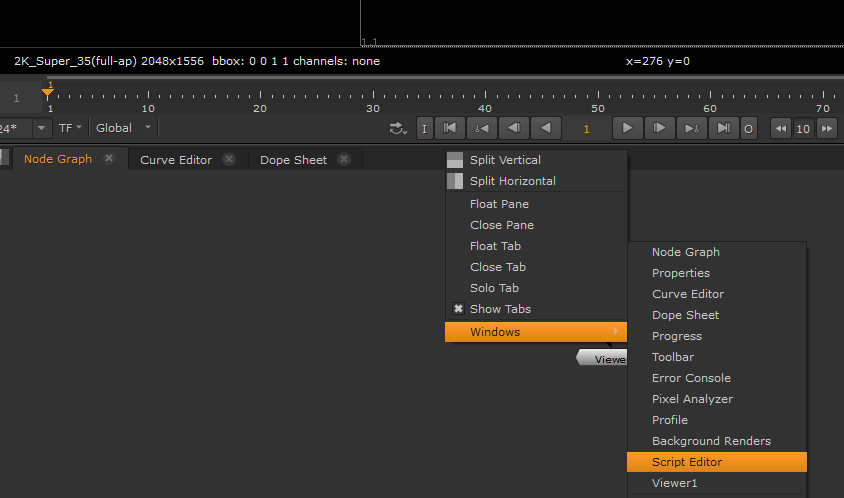
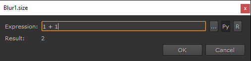
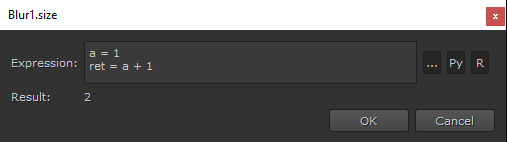
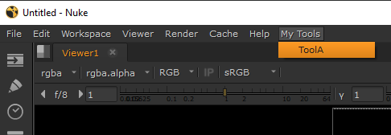

# Intro to Nuke API

## Where to use python in Nuke - Script Editor
Nuke has a builtin in script editor that can be accessed by right clicking in any of the tab headers (eg, Node Graph, Curve Editor, etc...) and selecting Windows > Script Editor.


The script editor has a top half for output, and a bottom half for writing scripts. You can press Ctrl+Enter to run only the selected code. Any python code you execute in Nuke will output to the script editor, make sure to check it if using print() to debug anything.

The Script Editor has autocomplete, press Tab to see the available actions.

## Where to write scripts for Nuke
Nuke has a default location for user scripts, which is a ".nuke" directory in your home folder, eg
* Windows: C:\\Users\\{USER}\\.nuke
* Unix (mac/linux): /home/{USER}/.nuke

Any modules in there are available in python. However, Nuke will automatically look for any scripts called either init.py or menu.py and automatically run it when starting up. This allows you to run any setup code, but also to add new locations to import from. The easiest way to do that is:
```python
import sys
sys.path.append("PATH TO YOUR FILES")
```

There is an important difference between init.py and menu.py. It is possible to run nuke in "Command Line (CLI)" or "Interactive (UI)" mode. Command Line doesn't have any UI, and is useful for things like rendering a scene that's already set up, or running scripts that generate nuke scripts. Interactive is the normal UI Nuke session.
* init.py is always run when nuke is started, whether in CLI or UI mode. If any UI code is included in here, it will crash nuke in CLI mode!
* menu.py is only run for UI sessions. This should be where you add custom menus, or UI tools.

## Nuke terminology
Nuke is a node based graph. Each action being performed in the scene is done by a "node", and every option on the node is available via a "knob", eg, a "Blur" node has a "size" knob for how much to blur. Nodes have "inputs" and "outputs", which are the connection arrows in the node graph. If a node has multiple inputs, they can be referenced by index, eg, a Merge node has two inputs by default (but can have more) named "A" and "B". Perhaps unexpectedly, the "B" input is the first input (0), and "A" is the second (1).

## Python in Nuke
There are a few ways to use python in Nuke; Expressions, Menus, Script Knobs, and Callbacks.

### Expressions
Knobs can have their values set by expressions, which can be either Nuke expressions (a builtin syntax that's quick and easy, but limited), TCL (a nuke language with very little documentation), or Python (which we all know and love). To add an expression, either right click the entry and choose "Add expression...", or put the cursor in the entry and press the = key. Expressions default to Nuke expressions, but can be changed to python by selecting the "Py" icon at the right.



By default, an expression must be one line of code, but can be more if the "R" icon is selected (Select the "..." icon as well for more space!). If using "R" mode the value that gets set is whatever is assigned to a variable called "ret" (short for return). If you do not set a "ret" variable in "R" mode, the expression will be an error.



### Menus
Custom tools can be written and exposed as menu actions. This is most commonly done via the menu.py by choosing the menu you want to add the command to, and adding it with `addCommand()`. See an example of this below
```python
import nuke

def tool_a():
    print("Running tool A")

# Accesses the main menu bar at the top
main_menu = nuke.menu("Nuke")
# "/" is used as a separator. This adds a new menu called "My Tools" and an action inside it called "ToolA"
# which runs the tool_a() function when selected
main_menu.addCommand("My Tools/ToolA", tool_a)
```
This adds a menu like this



It is good practice to write your functions inside a separate module, and only have the menu creation inside menu.py. This keeps things tidy, and makes it easy to add/remove menu items with a shared code source. For example, the above example should be done in two files like this:
```python
# mytools.py
def tool_a():
    print("Running tool A")
```
```python
# menu.py
import nuke
import mytools

main_menu = nuke.menu("Nuke")
main_menu.addCommand("My Tools/ToolA", mytools.tool_a)
```

### Script Knobs
It's possible to add custom knobs to nodes (or make entirely custom nodes) which can trigger python code. Here's a quick step by step guide to make a node with a custom python button:

1. Create a NoOp node in the scene.
2. Right click anywhere in the NoOp properties and select "Manage User Knobs...".
3. In the dialog that opens, click the "Add" dropdown and select "Python Script Button".
4. Give the button a name (follows variable naming rules) and optionally a label (any name to display).
5. Write your python code in the "Script" section.
6. When you're done, press "Ok".
7. Press "Done" to close the dialog.
8. Click the button to run your script!

You can always edit the code again via the "Manage User Knobs..." menu by selecting your button knob and pressing "Edit".

You _could_ use "import" in the Script to import code you've written elsewhere, but this would stop working if someone opened the scene without having access to your code (the default script location is in your home directory, which other users can't access). For this reason it's generally recommended to only use script buttons for small simple scripts that are not imported.

### Callbacks
Perhaps one of the most powerful features, nuke allows you to run a python function (known as a callback) whenever the user triggers certain actions, such as loading, saving, creating a node, etc... This is as simple as calling nuke.add{ACTION}({FUNCTION}) where {ACTION} is the name of the action being attached to, and {FUNCTION} is the function you want to run whenever the action happens - the function is just a regular python function, callback is just a term used to refer to a function that's called in response to an action. An example of showing a message whenever the user creates a node in the UI could be done like this:

```python
import nuke

def annoy_user():
    nuke.message("You created a node! Well done!")

nuke.addOnUserCreate(annoy_user)
```

Add that to a menu.py to drive someone mad.

To see what actions can have callbacks, see the [callback documentation](https://learn.foundry.com/nuke/developers/12.1/pythondevguide/callbacks.html). Remember to be careful about adding any UI based callbacks to init.py though as this could crash a CLI session.

## Python Reference
[Python API](https://learn.foundry.com/nuke/developers/121/pythonreference/)  
[Python Developer Guide](https://learn.foundry.com/nuke/developers/12.1/pythondevguide/index.html)  

Nuke's use of python is "Object Oriented". This means whenever you access a node it is a custom type with it's own methods, eg, a list has methods like ".append()", ".remove()", etc... a Node has methods like ".name()", ".parent()", ".input()", etc... Because of this, the core api doesn't need as many methods; you can access most of the functionality you need directly from the Nodes themselves.

* `toNode` : Finds a node in the scene by name.
* `createNode` : Creates a node of a specific type in the scene, eg, createNode("Blur")
* `allNodes` : Gets all nodes in the scene. Can be given a type to filter by, eg, allNodes("Read") gets all Read nodes in the scene
* `message` : Creates a simple UI popup dialog with a message for the user
* `root` : Accesses the project settings, which is considered the root node of the graph.
* `thisNode` : Used to access the current node. Commonly used in expressions / script buttons / callbacks.
* `thisKnob` : Used to access the current knob. Commonly used in expressions / script buttons.
* `execute` : Runs a Write node to actually render the output. Takes the write node/name to render from, and the start and end frames, eg, `nuke.execute("Write1", 1, 100)` renders node Write1 frames 1-100.

To access Knobs on a node, use the getitem syntax with the *name* of the knob you need (name, not label! Mouse over a knob to see the actual name). Knobs are objects just like nodes, with the most commonly used methods being "getValue()" and "setValue()".
```python
import nuke
blur_node = nuke.toNode("Blur1")
size_knob = blur_node["size"]
print(size_knob.getValue())
# 0.0
size_knob.setValue(1.0)
print(size_knob.getValue())
# 1.0
```

### Nested graphs
Nuke has "Group" nodes which are able to store another node graph inside them. By default, all python runs on the "root" scene graph, ie, the main Node Graph tab. In order to access nodes inside groups, we either need to explicitly refer to them by "full name", or change the current global "group".

#### Node names
Node names must be unique _per graph_ in nuke. This means nodes can have the same name if they belong to different groups, but will be automatically renamed if added to the same group. A "full name" is just the node names joined together by a "." separator, eg, a "Blur1" inside of a "Group1" would have a full name of "Group1.Blur1".
```python
node = nuke.toNode("Group1.Blur1")
node.name()
# Blur1
node.fullName()
# Group1.Blur1
```

#### Global group
Accessing by name is useful if we know exactly what we're looking for, but things like `allNodes` or `createNode` always work in the current group, which defaults to the root group. In order to make another group the "current" or "global" group, use the method `.begin()` on the group node. To finish working with the group, use the `.end()` method.
```python
group = nuke.toNode("Group1")
group.begin()
print(nuke.allNodes())
# [...] Contents of Group1
group.end()
print(nuke.allNodes())
# [...] Contents of the root group
```

Because begin() and end() tend to want to be used together, you can use the python `with` keyword to do this automatically. The same code above could be written as
```python
group = nuke.toNode("Group1")
with group:
    print(nuke.allNodes())
    # [...] Contents of Group1
print(nuke.allNodes())
# [...] Contents of the root group
```

Groups can also have inputs and outputs, but are empty by default when created using `createNode`. To add an input, create a node of type "Input" inside the group. The input can have a name by renaming the input node, or by adding it as a suffix to "Input", eg, an Input node called "mask" or "Inputmask" will both have an input arrow called "mask". To add an output, create a node of type "Output" inside the group.

# Putting it all together
Below is an example script which creates a simple graph and renders an image to a location.

```python
import nuke

checker = nuke.createNode("CheckerBoard2")
checker["format"].setValue("PAL")

group = nuke.createNode("Group")
with group:
    input_node = nuke.createNode("Input")
    blur = nuke.createNode("Blur")
    blur["size"].setValue(5.0)
    blur.connectInput(0, input_node)
    output_node = nuke.createNode("Output")
    output_node.connectInput(0, blur)

group.connectInput(0, checker)
write = nuke.createNode("Write")
write.connectInput(0, group)
write["file"].setValue("/path/to/output.png")  # Replace the path with somewhere on your filesystem: always use / separator
# Writes a single frame to the file set above
nuke.execute(write, 1, 1)
```
The graph it creates is:
```
[CheckerBoard1]
      |
   [Group1]
      |
   [Write1]
```

# Community resources
[Nukepedia](http://www.nukepedia.com/)

A lot of artists work in Nuke, and have already solved many of the problems people face. Nukepedia is a great resource which has python scripts, custom gizmos, tutorials, and references. Mouse over the "Downloads" or "Knowledge" sections for drop down options.

If you come up with something useful, put it on Nukepedia! Anyone can make an account and upload things (although everything gets checked by the admins, so it's always safe to download from there).
